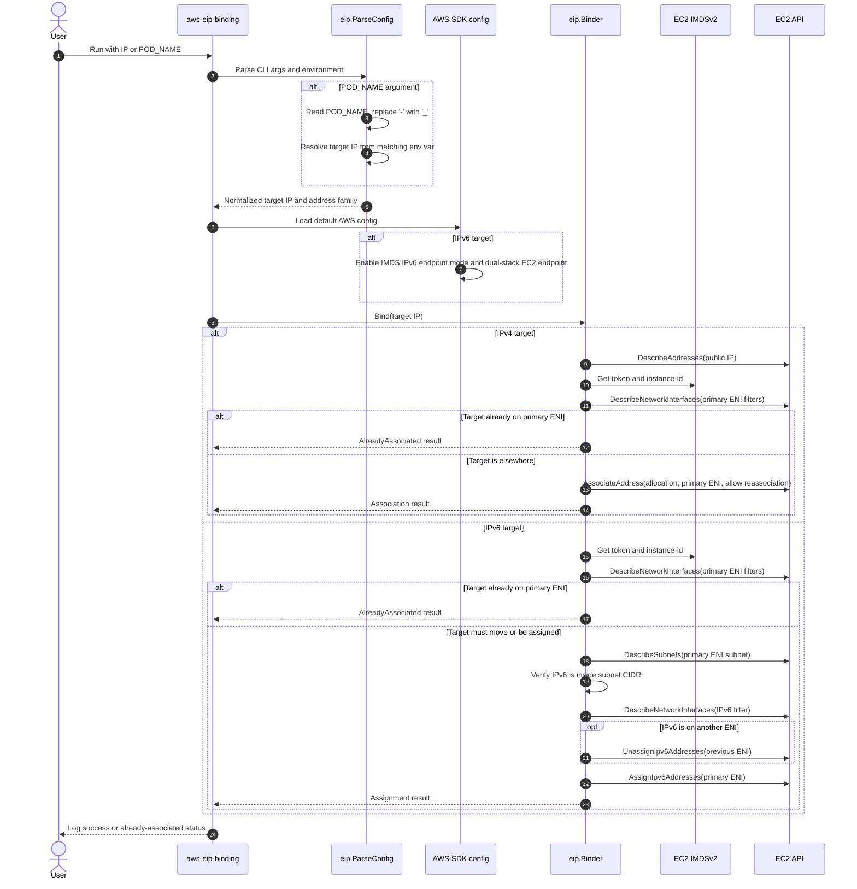
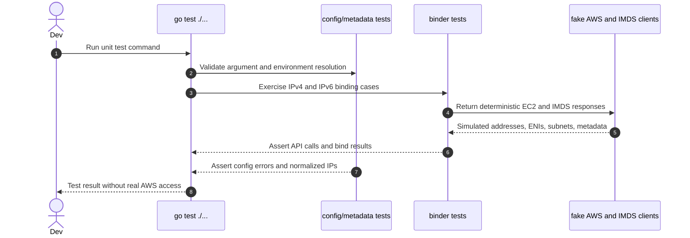
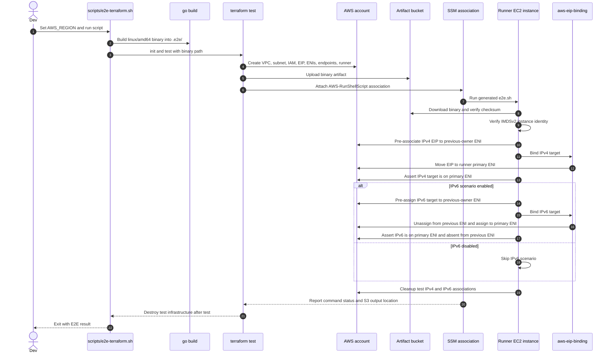

# AWS EIP Binding CLI

This CLI tool associates an IPv4 Elastic IP (EIP), or moves a specified IPv6 address, to the current EC2 instance using AWS SDK for Go.

## Usage

1. Build the application:

   ```
   go build -o aws-eip-binding
   ```

2. Run the tool with your target IP:

   ```
   ./aws-eip-binding <IP>
   ```

   IPv4 targets use Elastic IP association APIs. IPv6 targets are assigned to the current instance's primary ENI; if the IPv6 address is already assigned to another ENI, the tool unassigns it first and then assigns it to the current primary ENI. The IPv6 address must belong to the current primary ENI subnet's IPv6 CIDR block.

## Execution Flow



## Prerequisites

1. You're using IMDSv2

2. For IPv6 targets, the instance must support the IMDS IPv6 endpoint (`http://[fd00:ec2::254]`) and EC2 dual-stack service endpoints. The IMDS endpoint can still be overridden with `AWS_EC2_METADATA_SERVICE_ENDPOINT` for custom environments.

3. Ensure that the IAM role or user has permissions similar to the following:

```json
{
  "Version": "2012-10-17",
  "Statement": [
    {
      "Effect": "Allow",
      "Action": [
        "ec2:AssociateAddress",
        "ec2:AssignIpv6Addresses",
        "ec2:DescribeAddresses",
        "ec2:DescribeNetworkInterfaces",
        "ec2:DescribeSubnets",
        "ec2:DescribeTags",
        "ec2:UnassignIpv6Addresses"
      ],
      "Resource": "*"
    }
  ]
}
```

`ec2:DescribeNetworkInterfaces` should be validated against the
[AWS Service Authorization Reference](https://docs.aws.amazon.com/service-authorization/latest/reference/list_amazonec2.html)
or the Terraform-backed E2E test in a real AWS account.

## Testing

Run unit tests with:

```sh
go test ./...
```

The unit test path stays inside the Go process by using fakes for AWS and IMDS
interfaces, so it does not need AWS credentials or networked EC2 endpoints.



Check the Terraform E2E harness with:

```sh
terraform -chdir=test/e2e/terraform fmt -recursive -check
terraform -chdir=test/e2e/terraform init
terraform -chdir=test/e2e/terraform validate
```

Run the Terraform-backed AWS E2E suite with:

```sh
AWS_REGION=us-east-1 scripts/e2e-terraform.sh
```



The E2E harness builds a Linux amd64 binary, uploads it to a temporary S3
bucket, creates a disposable VPC, an Amazon Linux 2023 EC2 instance, and a
standalone ENI used as the previous address owner. SSM runs the CLI inside the
instance after pre-associating the target EIP and, when enabled, pre-assigning
the target IPv6 address to that previous-owner ENI. The test validates real
IMDSv2, the instance IAM role, automatic IPv4 EIP reassociation, and
IPv6 unassign-and-move behavior. Set `E2E_ENABLE_IPV6=false` to run only the
IPv4 scenario.

SSM command output is written to the temporary artifact bucket under
`ssm-output/<name-prefix>/`, which is useful for failed-run debugging before
Terraform destroys the test bucket.

Only run E2E tests in a disposable AWS account or isolated region. Terraform
creates real infrastructure that can incur short-lived EC2, EIP, S3, and VPC
endpoint charges. `terraform test` attempts to destroy test infrastructure when
it finishes, but you should still monitor cleanup and remove leftover resources
manually if a run is interrupted.

### Using POD_NAME Argument

If you pass "POD_NAME" as the CLI argument, the program will:

1. Retrieve the environment variable POD_NAME.
2. Replace all hyphens (-) in its value with underscores (\_), it's due to hyphens cannot be used in environment variable names.
3. Use the resulting string as the key to fetch the actual IP from the environment.

For example, if your environment is configured as follows:

- POD_NAME=app-config
- app_config=54.162.153.80

Running:
aws-eip-binding POD_NAME
will set the target IP to 54.162.153.80.

The resolved value can also be an IPv6 address, for example `2001:db8::1234`.

For example in Kubernetes, you can use the following snippet to set the environment variable:

```yaml
initContainers:
  - name: eip
    image: ghcr.io/islishude/aws-eip-binding
    imagePullPolicy: Always
    args: ["POD_NAME"]
    env:
      - name: "POD_NAME"
        valueFrom:
          fieldRef:
            apiVersion: v1
            fieldPath: metadata.name
      - name: "test_0"
        value: "54.162.153.80"
```
